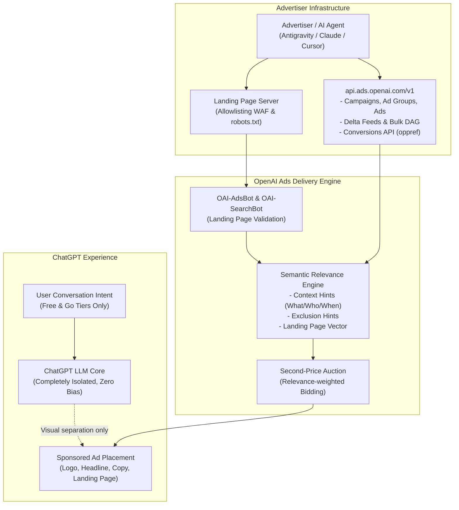

# 🤖 ChatGPT Ads (OpenAI Ads Manager Beta) — Mastery Skill & Engineering Blueprint

**[English](./README.md)** | [Tiếng Việt](./README.vi.md)

[](https://help.openai.com/en/collections/20001223-chatgpt-ads)
[](https://developers.openai.com/ads)
[](https://modelcontextprotocol.io/)
[](./LICENSE)

A battle-tested **AI Agent Skill**, **Architecture Blueprint**, and **MCP Server Product Requirement Document (PRD)** for planning, launching, and automating advertising campaigns on **ChatGPT Ads (OpenAI Ads Manager Beta)**.

---

## 🌟 Key Features & Breakthroughs

1. **Semantic Intent Matching (No Exact Keywords):**
   * ChatGPT Ads does not use traditional keyword auction matching.
   * Leverages natural language **Context Hints** (`WHAT` - `WHO` - `WHEN`) and `exclusion_hints` evaluated by OpenAI's relevance engine.
2. **Zero-Bias System Isolation:**
   * Pure physical and logical separation between the conversational chat LLM and the Ad Unit.
   * Advertisers cannot shape or bias ChatGPT's organic responses.
   * Ads appear only for **Free & Go** users; paid plans (Plus, Pro, Business, Enterprise, Edu) and Temporary Chats are completely ad-free.
3. **Automated Web Crawler Readiness:**
   * Allowlisting guidance for **`OAI-AdsBot`** (policy review) and **`OAI-SearchBot`** (media/catalog crawling).
   * Bypass rules for Cloudflare WAF, robots.txt, and rate-limit mitigation (HTTP 403 / 429).
4. **Developer & API Infrastructure (`api.ads.openai.com/v1`):**
   * Full technical specifications for **Delta Feeds API** (micro-updates to price/stock without catalog re-uploads).
   * **Bulk Mutation Jobs API** (asynchronous DAG processing of up to 1,000 entities with micro-unit billing).
   * Conversion tracking via proprietary **`oppref`** Click ID, JavaScript Pixel, Conversions API (CAPI), and No-JS 1x1 Image Tag.
5. **ChatGPT Ads MCP Server PRD:**
   * A comprehensive Product Requirements Document defining 12 Core Tools, OAuth 2.0 PKCE CLI flow, and an **Approval-Gated Shield** to safeguard ad budgets.

---

## 🏗️ System Architecture



---

## 📂 Repository Structure

```
chatgpt-ads-mcp/
├── skill/                                    # Ready-to-use Agent Skill
│   ├── SKILL.md                              # Main Agent Skill (<150 lines, Anti-Rule-Bloat)
│   └── references/                           # Deep technical modules
│       ├── context_hints_templates.md        # What-Who-When writing formulas across 5 industries
│       ├── bulk_upload_schema.md             # 3-tab CSV Bulk Upload schema & character constraints
│       ├── tracking_and_capi.md              # oppref Click ID, SHA-256 AAM, CAPI, No-JS Image Tag
│       ├── crawler_and_feed_specs.md         # WAF allowlisting, robots.txt, 14-day feed sync
│       └── advertiser_api_specs.md           # api.ads.openai.com/v1 endpoints, Delta Feeds, DAG Jobs
├── docs/                                     # Comprehensive Blueprints & Guides
│   ├── chatgpt_ads_master_guide.md           # 13KB Master Analytical Guide (Vietnamese)
│   └── chatgpt_ads_mcp_prd.md                # Full PRD & Architecture Blueprint for MCP Server
├── LICENSE                                   # MIT License
└── README.md                                 # Documentation & Quickstart
```

---

## 🚀 How to Install & Use the Skill

### 1. In Antigravity CLI / Agentic Environments
Simply clone or copy the `skill` folder into your agent skills directory:

```bash
mkdir -p ~/.agents/skills/chatgpt-ads
cp -r skill/* ~/.agents/skills/chatgpt-ads/
```

Antigravity CLI will automatically index and activate the skill whenever you discuss ChatGPT Ads, Context Hints, or OpenAI Ads Manager.

### 2. In Claude Desktop / Cursor
Add the contents of [`skill/SKILL.md`](./skill/SKILL.md) to your Project Instructions or system prompt rules.

---

## 📋 Quick Reference Cheat-Sheet

| Topic | Key Rule / Specification |
| :--- | :--- |
| **Launch Date & Region** | February 9, 2026 (US Beta Rollout) |
| **Eligible Audience** | Free & Go users (Age 18+ only) |
| **Ad-Free Zones** | Plus ($20), Pro ($200), Team, Enterprise, Edu, Temporary Chats |
| **Context Hints Formula** | `[WHAT: Features]` + `[WHO: Audience need]` + `[WHEN: Decision context]` |
| **Character Limits (Ads)** | Title: 16–24 chars rec. (max 50) \| Copy: 32–48 chars rec. (max 100) |
| **Image Asset Specs** | 1200 x 1200 px max, 1:1 square ratio, direct public HTTPS URL |
| **Web Crawlers** | `OAI-AdsBot` (Mandatory policy review) \| `OAI-SearchBot` (Catalog images) |
| **Click ID Parameter** | `?oppref=gAAAAAb...` (Must be preserved across URL redirects) |
| **Product Feed Lifecycle**| Expire after 14 days (Automate via HTTPS URL or SFTP) |
| **Delta Feeds Endpoint** | `PATCH /v1/feeds/{id}/products` (Prices in minor units, e.g. `8999` = `$89.99`) |
| **Bulk DAG Endpoint** | `POST /v1/bulk_mutation_jobs` (Up to 1,000 operations, amounts in micros) |

---

## 📄 License

This repository is licensed under the [MIT License](./LICENSE). Contributions and PRs are welcome!
