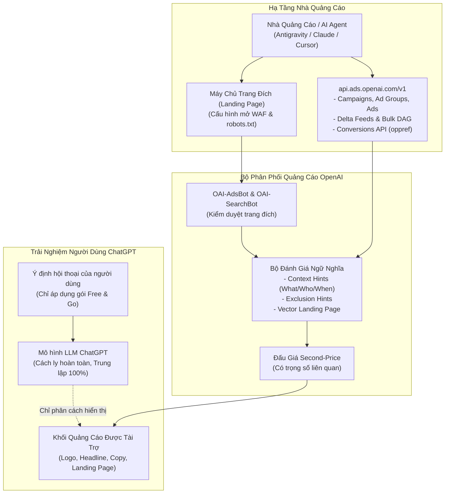

# 🤖 ChatGPT Ads (OpenAI Ads Manager Beta) — Kỹ Năng Agent & Bản Thiết Kế Kỹ Thuật

[English](./README.md) | **[Tiếng Việt](./README.vi.md)**

[](https://help.openai.com/en/collections/20001223-chatgpt-ads)
[](https://developers.openai.com/ads)
[](https://modelcontextprotocol.io/)
[](./LICENSE)

Bộ tài nguyên thực chiến toàn diện bao gồm: **Kỹ Năng AI Agent**, **Cẩm Nang Kiến Trúc Phân Phối**, và **Bản Đặc Tả Yêu Cầu Sản Phẩm (PRD) cho MCP Server** để lên kế hoạch, khởi tạo, tối ưu hóa và tự động hóa các chiến dịch quảng cáo trên **ChatGPT Ads (OpenAI Ads Manager Beta)**.

---

## 🌟 Tính Năng Cốt Lõi & Đột Phá Kỹ Thuật

1. **Khớp Ngữ Nghĩa Tự Nhiên (Semantic Intent Matching - Không Dùng Từ Khóa):**
   * ChatGPT Ads không sử dụng đấu giá từ khóa truyền thống (Exact/Phrase Keywords).
   * Vận hành dựa trên **Context Hints** tự nhiên (`WHAT` - `WHO` - `WHEN`) và `exclusion_hints` được phân tích bởi bộ thẩm định ngữ nghĩa của OpenAI.
2. **Nguyên Tắc Cách Ly Trung Lập (Zero-Bias System Isolation):**
   * Cách ly hoàn toàn về mặt logic và vật lý giữa mô hình ngôn ngữ lớn (LLM chat) và khối hiển thị quảng cáo (Ad Unit).
   * Nhà quảng cáo không thể can thiệp hay làm thiên vị câu trả lời tự nhiên của ChatGPT.
   * Quảng cáo chỉ hiển thị cho người dùng gói **Free & Go**; các gói trả phí (Plus, Pro, Business, Enterprise, Edu) và Đoạn chat tạm thời (Temporary Chats) hoàn toàn miễn nhiễm.
3. **Sẵn Sàng Cho Web Crawlers Của OpenAI:**
   * Hướng dẫn chi tiết mở danh sách trắng cho **`OAI-AdsBot`** (kiểm duyệt chính sách) và **`OAI-SearchBot`** (nạp media/catalog).
   * Cấu hình vượt qua Cloudflare WAF, file `robots.txt` và hạn chế lỗi 403 Forbidden / 429 Rate Limit.
4. **Hạ Tầng Lập Trình & API (`api.ads.openai.com/v1`):**
   * Đặc tả kỹ thuật đầy đủ cho **Delta Feeds API** (cập nhật vi mô giá/kho mà không cần tải lại toàn bộ catalog).
   * **Bulk Mutation Jobs API** (xử lý bất đồng bộ đồ thị DAG tới 1.000 tác vụ, tiền tệ tính bằng `micros`).
   * Đo lường chuyển đổi qua mã Click ID độc quyền **`oppref`**, JavaScript Pixel, Conversions API (CAPI), và thẻ No-JS 1x1 Image Tag.
5. **Bản Thiết Kế PRD Cho ChatGPT Ads MCP Server:**
   * Bản PRD chi tiết định nghĩa 12 Core Tools, luồng xác thực OAuth 2.0 PKCE CLI Flow, và lớp bảo vệ ngân sách **Approval-Gated Shield**.

---

## 🏗️ Kiến Trúc Hệ Thống (System Architecture)



---

## 📂 Cấu Trúc Thư Mục Repository

```
chatgpt-ads-mcp/
├── skill/                                    # Bộ Kỹ Năng Sẵn Sàng Kích Hoạt Cho AI Agent
│   ├── SKILL.md                              # File điều phối chính (<150 dòng chuẩn Anti-Rule-Bloat)
│   └── references/                           # Các module kỹ thuật chuyên sâu
│       ├── context_hints_templates.md        # Mẫu viết What-Who-When cho 5 ngành hàng
│       ├── bulk_upload_schema.md             # Quy chuẩn bảng tính CSV 3 tabs & giới hạn ký tự
│       ├── tracking_and_capi.md              # Tham số oppref, SHA-256 AAM, CAPI, No-JS Image Tag
│       ├── crawler_and_feed_specs.md         # Quy chuẩn WAF cho OAI-AdsBot, chu kỳ 14 ngày Product Feed
│       └── advertiser_api_specs.md           # api.ads.openai.com/v1, Delta Feeds, Bulk DAG Jobs
├── docs/                                     # Tài Liệu Phân Tích Chuyên Sâu & PRD
│   ├── chatgpt_ads_master_guide.md           # Cẩm nang toàn diện ChatGPT Ads (13 KB)
│   └── chatgpt_ads_mcp_prd.md                # Bản PRD & Thiết kế Kiến Trúc MCP Server (14 KB)
├── LICENSE                                   # Giấy phép MIT
├── README.md                                 # Bản tiếng Anh (English)
└── README.vi.md                              # Bản tiếng Việt (Vietnamese)
```

---

## 🚀 Hướng Dẫn Cài Đặt & Sử Dụng

### 1. Trong Antigravity CLI / Môi Trường AI Agent
Chỉ cần sao chép thư mục `skill` vào thư mục lưu trữ skills của agent:

```bash
mkdir -p ~/.agents/skills/chatgpt-ads
cp -r skill/* ~/.agents/skills/chatgpt-ads/
```

Antigravity CLI sẽ tự động lập chỉ mục và kích hoạt kỹ năng mỗi khi bạn thảo luận về ChatGPT Ads, viết Context Hints, hoặc cấu hình OpenAI Ads Manager.

### 2. Trong Claude Desktop / Cursor
Thêm toàn bộ nội dung của [`skill/SKILL.md`](./skill/SKILL.md) vào mục Project Instructions hoặc System Prompt của bạn.

---

## 📋 Bảng Tra Cứu Nhanh Quy Chuẩn Kỹ Thuật (Cheat-Sheet)

| Thành Phần | Quy Tắc / Thông Số Kỹ Thuật |
| :--- | :--- |
| **Thời Điểm & Khu Vực** | 09/02/2026 (Khởi đầu tại thị trường US Beta) |
| **Đối Tượng Hiển Thị** | Người dùng Free & Go (Độ tuổi từ 18 trở lên) |
| **Khu Vực Miễn Nhiễm Ads** | Plus ($20), Pro ($200), Team, Enterprise, Edu, Temporary Chats |
| **Công Thức Context Hints** | `[WHAT: Tính năng]` + `[WHO: Đối tượng/nhu cầu]` + `[WHEN: Tình huống/bài toán]` |
| **Giới Hạn Ký Tự Mẫu Ad** | Tiêu đề: 16–24 ký tự tối ưu (tối đa 50) \| Mô tả: 32–48 ký tự tối ưu (tối đa 100) |
| **Kích Thước Ảnh Creative** | Tối đa 1200 x 1200 px, tỷ lệ vuông 1:1, đường dẫn HTTPS công khai trực tiếp |
| **Web Crawlers Cần Mở** | `OAI-AdsBot` (Bắt buộc kiểm duyệt) \| `OAI-SearchBot` (Tải ảnh catalog) |
| **Tham Số Định Danh Click** | `?oppref=gAAAAAb...` (Bắt buộc bảo toàn khi chuyển hướng URL) |
| **Vòng Đời Product Feed** | Tự động hết hạn sau 14 ngày (Cần tự động hóa qua HTTPS URL hoặc SFTP) |
| **Delta Feeds Endpoint** | `PATCH /v1/feeds/{id}/products` (Giá tính theo đơn vị phụ *minor units*, ví dụ `8999` = `$89.99`) |
| **Bulk DAG Endpoint** | `POST /v1/bulk_mutation_jobs` (Tối đa 1.000 tác vụ/job, tiền tệ tính bằng `micros`) |

---

## 📄 Giấy Phép (License)

Dự án được phân phối dưới giấy phép [MIT License](./LICENSE). Rất hoan nghênh mọi đóng góp và Pull Requests từ cộng đồng!
