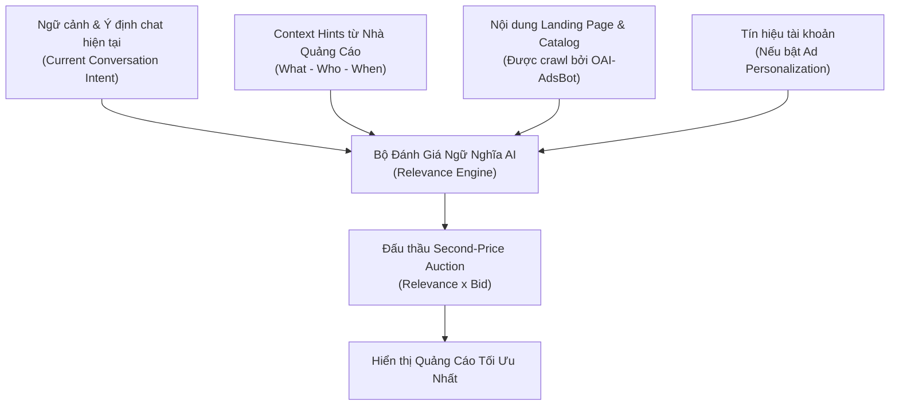
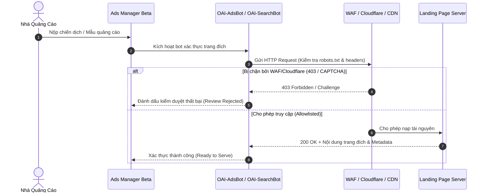

# Cẩm Nang Toàn Diện: ChatGPT Ads (OpenAI Ads Manager Beta)
*Tài liệu phân tích kiến trúc, cơ chế phân phối ngữ nghĩa, chiến lược Context Hints và quy chuẩn kỹ thuật*

---

## 1. Tổng Quan & Lộ Trình Triển Khai (Executive Overview)

OpenAI chính thức khởi động thử nghiệm giới hạn **ChatGPT Ads (OpenAI Ads Manager Beta)** từ ngày **09/02/2026** tại thị trường Hoa Kỳ (US) và đang mở rộng dần theo từng giai đoạn.

### 1.1. Đối Tượng Phục Vụ & Phân Tầng Tài Khoản
* **Hiển thị quảng cáo:** Chỉ hiển thị với người dùng trên các gói **Free** và **Go**.
* **Miễn nhiễm hoàn toàn (Ad-Free Zones):**
  * Tất cả tài khoản trả phí: **Plus ($20/mo), Pro ($200/mo), Business, Enterprise, và Edu**.
  * Tài khoản người dùng **dưới 18 tuổi** (xác định qua tuổi khai báo và mô hình AI dự đoán hành vi).
  * **Temporary Chats (Đoạn chat tạm thời)**: Tuyệt đối không hiển thị quảng cáo.
  * **ChatGPT Atlas Browser**: Chưa tích hợp quảng cáo trong giai đoạn thử nghiệm.

### 1.2. Nguyên Tắc Cách Ly Hệ Thống (System Isolation & AI Neutrality)
* **Zero-Bias Guarantee:** Hệ thống phân phối quảng cáo chạy hoàn toàn **độc lập** với mô hình ngôn ngữ lớn (LLM chat model).
* Nhà quảng cáo **không thể can thiệp, định hướng hay làm thiên vị** câu trả lời tự nhiên của ChatGPT.
* ChatGPT mặc định **không nhìn thấy quảng cáo** xuất hiện bên dưới câu trả lời của chính nó, trừ khi người dùng chủ động chọn tính năng `"Ask ChatGPT"` từ menu 3 chấm của mẫu quảng cáo.

```
+-----------------------------------------------------------+
|                     ChatGPT Response                      |
|  (Được sinh ra thuần túy bởi LLM, khách quan, không bị   |
|   tác động bởi ngân sách hay nhà quảng cáo)               |
+-----------------------------------------------------------+
                             |
                   [Ranh giới cách ly]
                             |
+-----------------------------------------------------------+
|                   SPONSORED AD PLACEMENT                  |
|  - Logo / Favicon            - Tên nhà quảng cáo           |
|  - Tiêu đề (Headline)        - Nội dung (Copy)            |
|  - Hình ảnh sản phẩm         - Landing Page URL           |
+-----------------------------------------------------------+
```

---

## 2. Định Dạng Quảng Cáo & Trải Nghiệm Tương Tác

### 2.1. Định dạng Tiêu chuẩn (Standard Ad Unit)
Quảng cáo xuất hiện ngay dưới câu trả lời của ChatGPT, được dán nhãn **Sponsored** rõ ràng, bao gồm:
* Tên nhà quảng cáo (Advertiser Name) & Favicon / Logo.
* Tiêu đề quảng cáo (Title / Headline).
* Đoạn mô tả (Copy / Description).
* Hình ảnh sáng tạo (Image Asset / Creative).
* Liên kết đích (Landing Page URL).

### 2.2. Định dạng Tác tử Tài trợ (Sponsored Agents - Alpha)
* **Khái niệm:** Cho phép người dùng trực tiếp mở một phiên hội thoại với **AI đại diện của doanh nghiệp** ngay bên trong ChatGPT từ mẫu quảng cáo.
* **Mục đích:** Hỗ trợ giải đáp chuyên sâu về sản phẩm, tư vấn cấu hình, giải quyết thắc mắc trong quá trình ra quyết định mua sắm phức tạp.
* **Trạng thái:** Hiện đang trong giai đoạn Alpha thử nghiệm nội bộ với các đối tác chọn lọc (chưa mở đăng ký tự do).

---

## 3. Cơ Chế Khớp Ngữ Nghĩa: Context Hints vs Traditional Keywords

ChatGPT Ads **không sử dụng từ khóa khớp chính xác (Exact Keywords)** như Google Search Ads. Thay vào đó, nền tảng vận hành trên mô hình **Semantic Relevance & Outcome-Based Matching**.



### 3.1. Phương Pháp Luận Soạn Thảo Context Hints Chuẩn
Context Hints là các chỉ dẫn ngữ nghĩa tự nhiên ở cấp độ **Ad Group** giúp hệ thống hiểu khi nào quảng cáo thực sự hữu ích cho người dùng. Khi viết Context Hints, cần bám sát tam giác thông tin:

1. **WHAT (Sản phẩm là gì):** Tính năng đặc thù, phân khúc giá, phạm vi cung cấp dịch vụ.
2. **WHO (Phục vụ ai):** Chân dung khách hàng mục tiêu, nhu cầu cụ thể, hoàn cảnh đặc biệt.
3. **WHEN (Hữu ích khi nào):** Tình huống ra quyết định, bài toán thực tế khách hàng đang cần giải quyết.

### 3.2. Bảng Đối Chiếu Tư Duy: Keywords Cũ vs Context Hints Mới

| Tiêu chí | Search Ads Truyền Thống (Google Ads) | ChatGPT Ads (Context Hints) |
| :--- | :--- | :--- |
| **Cơ chế** | So khớp chuỗi từ khóa (Exact, Phrase, Broad) | Phân tích vector ngữ nghĩa và ngữ cảnh hội thoại |
| **Cú pháp** | Danh sách từ khóa: `[giày chạy bộ], "giày marathon"` | Câu văn tự nhiên mô tả nhu cầu và tình huống |
| **Ví dụ dở** | Nhồi nhét từ khóa: `"giày thể thao, mua giày rẻ"` | Lệnh giao dịch: *"Chỉ hiển thị cho người dùng ở Hà Nội"* |
| **Ví dụ chuẩn** | - | *"Giày chạy bộ êm ái hàng ngày dành cho người mới bắt đầu luyện tập cự ly 5K đầu tiên"* |
| **Bản chất** | Ép buộc hiển thị khi có từ khóa | Cung cấp ngữ cảnh để AI tự đánh giá độ liên quan |

> [!IMPORTANT]
> **Context Hints không phải là quy tắc lọc vị trí hay giới hạn hiển thị.** 
> Nếu bạn viết *"Dịch vụ sửa ống nước tại Chicago"*, đó là ngữ cảnh sản phẩm. Nhưng viết *"Chỉ hiển thị quảng cáo này cho người ở Chicago"* là sai bản chất, việc phân vùng địa lý phải cấu hình tại phần **Location Settings** của chiến dịch.

---

## 4. Chiến Lược Đấu Thầu & Tối Ưu Hóa Chiến Dịch

### 4.1. Các Mô Hình Tính Phí & Đấu Giá
* **Cơ chế đấu giá:** **Relevance-weighted, Second-price Auction** (Đấu giá giá thứ hai có trọng số liên quan).
* **Các mục tiêu chiến dịch (Objectives):**
  1. **Views (CPM):** Tối ưu hóa lượt hiển thị nhận diện thương hiệu.
  2. **Clicks (CPC):** Tối ưu hóa lưu lượng truy cập. Giá thầu khuyến nghị ban đầu: **$3.00 – $5.00 USD / Click**.
  3. **Conversions (oCPC / Impression-based):** Tối ưu hóa hành động chuyển đổi hạ nguồn (Mua hàng, Đăng ký, Điền Lead form).

### 4.2. Chiến dịch Tối ưu Chuyển đổi (Conversion-optimized Campaigns)
Có 2 hình thức thanh toán khi chọn mục tiêu chuyển đổi:
* **Click Billing (oCPC):** Trả tiền cho các click chuột hợp lệ, hệ thống tự động tối ưu thuật toán tìm kiếm người dùng có xác suất chuyển đổi cao sau khi click.
* **Impression Billing (CPM-based Conversion):** Trả tiền theo lượt hiển thị, nhưng AI tối ưu hóa trên toàn bộ hành trình chuyển đổi đa điểm chạm (Bao gồm cả View-through conversions và Click-through conversions).

### 4.3. Product Feeds (Quảng Cáo Sản Phẩm Bán Lẻ Quy Mô Lớn)
* Dành cho các đơn vị bán lẻ, thương mại điện tử có danh mục hàng hóa lớn hoặc thay đổi thường xuyên.
* **Phương thức nạp catalog:**
  * File tĩnh: CSV / TXT.
  * Hosted URL: Tự động đồng bộ qua đường dẫn HTTPS an toàn.
  * Server-to-server: Giao thức tự động hóa qua SFTP.
* **Thời gian sống:** Dữ liệu sản phẩm hết hạn sau **2 tuần**, bắt buộc phải thiết lập cập nhật định kỳ qua URL hoặc SFTP.
* **Phân nhóm sản phẩm:** Sử dụng trường `ads_metadata` (ví dụ `bidding_tier`, `custom_label_0`) để áp bộ lọc tạo Ad Group tương ứng.

---

## 5. Quy Chuẩn Kỹ Thuật Cho Web Crawlers Của OpenAI

Trước khi phân phối quảng cáo, OpenAI quét trực tiếp Landing Page để kiểm duyệt an toàn nội dung, tính xác thực và trích xuất vector ngữ nghĩa.



### 5.1. Hai Bot Bắt Buộc Cần Mở Khóa
1. **`OAI-AdsBot` (Bắt buộc 100%):** Chịu trách nhiệm kiểm duyệt chính sách và xác thực tính hợp lệ của Landing Page. Đã được Cloudflare xác thực và đưa vào danh sách trắng toàn cầu.
2. **`OAI-SearchBot` (Khuyến nghị cao):** Dùng để hiểu cấu trúc nội dung web công khai và tải các URL hình ảnh sản phẩm trong Product Feed.

### 5.2. Cấu hình `robots.txt` Chuẩn
```txt
User-agent: OAI-AdsBot
Allow: /

User-agent: OAI-SearchBot
Allow: /
```

### 5.3. Xử Lý Các Sự Cố Chặn Crawler Thường Gặp
* **Lỗi 403 Forbidden:** Do Cloudflare WAF, Akamai hoặc các bộ lọc anti-bot chặn. Cần cấu hình bypass rule cho User-Agent `OAI-AdsBot` hoặc mở dải IP theo `https://openai.com/adsbot.json` và `https://openai.com/searchbot.json`.
* **Lỗi 429 Too Many Requests:** Xảy ra khi upload chiến dịch hàng loạt qua file Bulk Upload khiến crawler gửi request dồn dập. Khắc phục bằng cách nạp theo từng đợt nhỏ.
* **Trang đích không hợp lệ:** Không sử dụng link trực tiếp tới App Store, Deep-link nội bộ ứng dụng hoặc trang yêu cầu đăng nhập.

---

## 6. Bảo Mật Người Dùng & An Toàn Thương Hiệu (Brand Safety)

* **Không bán và không chia sẻ hội thoại:** OpenAI không chia sẻ nội dung chat, lịch sử hội thoại, bộ nhớ (memories) hay danh tính người dùng cho nhà quảng cáo. Nhà quảng cáo chỉ nhận được báo cáo tổng hợp (Aggregated metrics: Views, Clicks, Spend, CTR).
* **Quyền kiểm soát của người dùng (Ad Controls):** Người dùng có quyền tắt cá nhân hóa quảng cáo (Settings > Ad Controls), xóa dữ liệu quảng cáo hoặc ẩn mẫu quảng cáo.
* **Bộ lọc chủ đề nhạy cảm (Negative Context Exclusions):** Quảng cáo tuyệt đối không xuất hiện trong các đoạn hội thoại liên quan đến:
  * Sức khỏe cá nhân & Y tế nhạy cảm.
  * Tâm lý & Khủng hoảng tinh thần.
  * Nội dung chính trị và bầu cử (Hoàn toàn cấm quảng cáo chính trị trên ChatGPT).

---

## 7. Bảng Tóm Tắt Thông Số Kỹ Thuật (Quick Reference Cheat-Sheet)

| Thành phần | Thông số / Quy tắc |
| :--- | :--- |
| **Thời điểm triển khai** | 09/02/2026 (Bắt đầu tại US Beta) |
| **Nhóm người dùng thấy ads** | Free & Go accounts (Không thuộc diện vị thành niên <18) |
| **Nhóm người dùng loại trừ** | Plus, Pro, Business, Enterprise, Edu, và Temporary Chats |
| **Giá thầu khởi điểm CPC** | Khuyến nghị $3.00 – $5.00 USD / Click |
| **Độ trễ cập nhật báo cáo** | Clicks/Impressions: ~15 phút; Báo cáo chi phí (Spend): ~7–8 giờ |
| **Thời hạn sống Product Feed** | 14 ngày (Cần cơ chế tự động đồng bộ qua HTTPS / SFTP) |
| **User-Agent kiểm duyệt web** | `OAI-AdsBot` (Bắt buộc), `OAI-SearchBot` (Khuyến nghị) |
| **Giao thức chuyển đổi** | JavaScript Pixel (hỗ trợ Advanced Matching) & Conversions API |
| **Cơ chế đấu thầu chuyển đổi** | oCPC (Click billing) hoặc CPM (Impression billing) |
