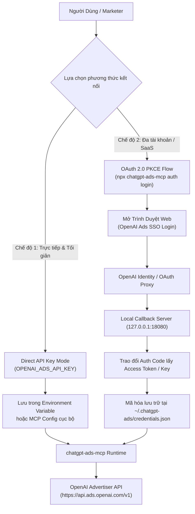
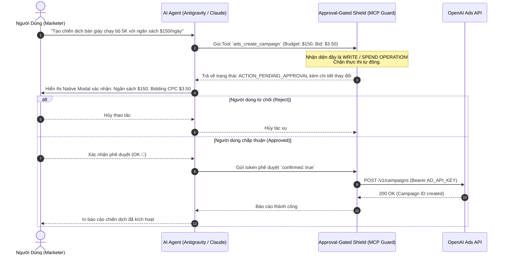
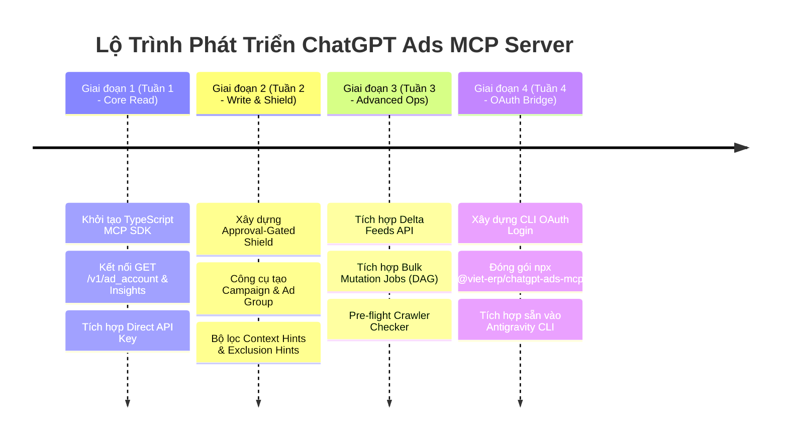

# Product Requirements Document (PRD)
# ChatGPT Ads Model Context Protocol (MCP) Server
**Tên dự án:** `chatgpt-ads-mcp`  
**Phiên bản:** `1.0.0-Blueprint`  
**Tác giả:** Antigravity AI Engineering Team  
**Mục tiêu:** Cung cấp cầu nối tiêu chuẩn Model Context Protocol (MCP) kết nối các AI Agent (Antigravity CLI, Claude Desktop, Cursor) với cổng lập trình OpenAI Advertiser API (`api.ads.openai.com/v1`).

---

## 1. Tổng Quan & Tầm Nhìn Sản Phẩm (Product Vision)

### 1.1. Bối Cảnh
OpenAI đã chính thức ra mắt nền tảng **ChatGPT Ads** (OpenAI Ads Manager Beta) cùng cổng lập trình **OpenAI Advertiser API** (`api.ads.openai.com/v1`). Khác với Search Ads truyền thống, ChatGPT Ads vận hành trên cơ chế khớp ngữ nghĩa tự nhiên (**Context Hints: What - Who - When**). 

Tuy nhiên, việc thiết lập chiến dịch qua giao diện web thủ công hoặc viết code REST API truyền thống tiêu tốn nhiều thời gian và dễ mắc lỗi (đặc biệt là sai định dạng JSON, tràn ký tự tiêu đề, hoặc cấu hình WAF chặn bot).

### 1.2. Sứ Mệnh Sản Phẩm
**`chatgpt-ads-mcp`** biến AI Agent thành một **Media Buyer & Growth Engineer tự động hóa**:
* Quản trị chiến dịch quảng cáo hoàn toàn bằng hội thoại tự nhiên.
* Tự động sinh và tinh chỉnh Context Hints / Exclusion Hints chuẩn ngữ nghĩa.
* Cập nhật tức thì giá và tồn kho danh mục sản phẩm (Delta Feeds API).
* Tự động tạo đồ thị phụ thuộc chiến dịch hàng loạt (Bulk Mutation DAG).
* Tích hợp cơ chế **Approval-Gated Shield** để bảo vệ ngân sách nhà quảng cáo an toàn 100%.

---

## 2. Kiến Trúc Xác Thực: OAuth 2.0 vs API Key

Người dùng đặt câu hỏi trọng tâm: *Có kết nối qua OAuth được không?*

### 2.1. Phân Tích Thực Trạng Kiến Trúc Xác Thực Của OpenAI
1. **Ở cấp độ Native REST API:** OpenAI Advertiser API sử dụng chuẩn **Bearer Token tĩnh** (`OPENAI_ADS_API_KEY`), được sinh trực tiếp trong `Ads Manager > Settings > API Keys` và gắn chặt (scoped) với một `ad_account_id`.
2. **Ở cấp độ Tích Hợp Người Dùng (Client Integration):** OpenAI **HỖ TRỢ** OAuth SSO thông qua OpenAI Tenant / Cloud Console và đã có các bên thứ 3 (như HYPD, PaidSync, Insightful Pipe) triển khai thành công luồng OAuth CLI / Web Flow.

### 2.2. Thiết Kế 2 Chế Độ Xác Thực (Dual-Auth Architecture)



| Tiêu chí | Chế độ 1: Direct API Key (Khuyến nghị cho Local Dev) | Chế độ 2: OAuth 2.0 CLI Bridge (Khuyến nghị cho End-users) |
| :--- | :--- | :--- |
| **Cơ chế** | Đọc biến môi trường `OPENAI_ADS_API_KEY` | Mở trình duyệt web, đăng nhập Ads Manager và cấp quyền |
| **Độ phức tạp** | Rất thấp (Zero dependency) | Trung bình (Cần local callback listener `127.0.0.1:port`) |
| **Trải nghiệm** | Dành cho Developer, Kỹ sư Automation | Thân thiện cho Marketer, không cần copy-paste API Key |
| **Bảo mật** | Key lưu cục bộ trong file cấu hình MCP | Token có thể tự động refresh, hỗ trợ phân quyền scope |
| **Đa tài khoản** | Đổi biến môi trường thủ công | Cho phép chọn nhanh Ad Account qua menu dòng lệnh |

---

## 3. Kiến Trúc An Toàn: Lớp Bảo Vệ Phê Duyệt (Approval-Gated Shield)

Quảng cáo liên quan trực tiếp đến chi tiêu tài chính thực tế. Nếu AI Agent gặp ảo giác (hallucination) và tự ý đặt ngân sách $10,000/ngày, hậu quả sẽ rất nghiêm trọng.



### Phân Loại 2 Nhóm Tools:
1. **Safe / Read Tools (Tự do gọi):** Lấy báo cáo (`insights`), xem danh sách chiến dịch (`list_campaigns`), kiểm tra trạng thái bot (`audit_crawler`), đọc danh mục hàng hóa (`get_feeds`).
2. **Gated / Write Tools (Bắt buộc phê duyệt):** Tạo chiến dịch (`create_campaign`), tăng/giảm ngân sách (`update_budget`), nạp tác vụ DAG (`bulk_mutation`), sửa giá thầu (`update_bids`).

---

## 4. Danh Mục 12 Core Tools Chi Tiết (Toolset Specification)

Dưới đây là danh mục 12 công cụ chuẩn được thiết kế tương thích 100% với JSON-Schema của Model Context Protocol:

### Nhóm 1: Tài Khoản & Báo Cáo Hiệu Suất (Account & Analytics)
* **`ads_verify_account`**
  * *Mô tả:* Kiểm tra trạng thái tài khoản quảng cáo, đơn vị tiền tệ, trạng thái nợ/thanh toán (`good_standing`) và hạn mức chi tiêu ngày.
  * *API tương ứng:* `GET /v1/ad_account`
* **`ads_get_insights`**
  * *Mô tả:* Truy vấn dữ liệu hiệu suất (Impressions, Clicks, Spend, CTR, CPC, CPA, Conversions) theo khoảng thời gian và phân rã (hourly, daily, theo ad hoặc ad_group).
  * *API tương ứng:* `GET /v1/ad_account/insights` & `GET /v1/ads/{id}/insights`

### Nhóm 2: Quản Trị Chiến Dịch & Phân Tầng Nền Tảng (Campaign Management)
* **`ads_list_campaigns`**
  * *Mô tả:* Lấy danh sách các chiến dịch đang hoạt động hoặc tạm dừng, kèm thông số ngân sách và mục tiêu.
  * *API tương ứng:* `GET /v1/campaigns`
* **`ads_create_campaign`** *(Approval-Gated)*
  * *Mô tả:* Khởi tạo chiến dịch mới với mục tiêu (`Views`, `Clicks`, `Conversions`), ngân sách ngày/lifetime, mã quốc gia và phân tầng thiết bị (`android_app`, `ios_app`, `desktop_web`...).
  * *API tương ứng:* `POST /v1/campaigns`
* **`ads_update_campaign_budget`** *(Approval-Gated)*
  * *Mô tả:* Điều chỉnh ngân sách hoặc trạng thái (`active`, `paused`, `archived`) của chiến dịch.
  * *API tương ứng:* `PATCH /v1/campaigns/{id}`

### Nhóm 3: Nhóm Quảng Cáo & Kỹ Nghệ Ngữ Nghĩa (Ad Groups & Hints)
* **`ads_manage_ad_group`** *(Approval-Gated)*
  * *Mô tả:* Tạo hoặc cập nhật Ad Group, tự động định dạng và nạp danh sách **Context Hints** (What-Who-When) cùng **Exclusion Hints** (loại trừ ngữ cảnh).
  * *API tương ứng:* `POST /v1/ad_groups` & `PATCH /v1/ad_groups/{id}`

### Nhóm 4: Mẫu Quảng Cáo & Tài Nguyên Đa Phương Tiện (Ads & Creatives)
* **`ads_upload_creative`**
  * *Mô tả:* Tải hình ảnh quảng cáo (PNG/JPG, tối đa 1200x1200px, 1:1) lên CDN của OpenAI và nhận về `file_id`.
  * *API tương ứng:* `POST /v1/upload` (Multipart)
* **`ads_create_ad`** *(Approval-Gated)*
  * *Mô tả:* Tạo mẫu quảng cáo hoàn chỉnh kết nối `file_id` với tiêu đề (tối đa 50 ký tự), nội dung mô tả (tối đa 100 ký tự) và Landing Page URL.
  * *API tương ứng:* `POST /v1/ads`

### Nhóm 5: Đột Phá Kỹ Thuật (Feeds, Bulk DAG & Tracking)
* **`ads_delta_feed_sync`**
  * *Mô tả:* Cập nhật vi mô giá sản phẩm (đơn vị minor units) và trạng thái kho (`in_stock` / `out_of_stock`) cho từng SKU biến thể mà không cần tải lại toàn bộ catalog.
  * *API tương ứng:* `PATCH /v1/feeds/{id}/products`
* **`ads_bulk_mutation`** *(Approval-Gated)*
  * *Mô tả:* Gửi đồ thị phụ thuộc (DAG) tạo hàng loạt tới 1.000 đối tượng (Campaign -> Ad Group -> Ad) trong 1 job bất đồng bộ duy nhất, ngân sách tính bằng `micros`.
  * *API tương ứng:* `POST /v1/bulk_mutation_jobs`
* **`ads_audit_crawler_readiness`**
  * *Mô tả:* Pre-flight check tự động kiểm tra xem URL trang đích có bị WAF/Cloudflare chặn User-Agent `OAI-AdsBot` và `OAI-SearchBot` hay không trước khi submit ad.
* **`ads_send_conversion_event`**
  * *Mô tả:* Bắn sự kiện chuyển đổi ngoại tuyến từ backend về Conversions API của OpenAI với tham số Click ID `oppref` và băm SHA-256 dữ liệu khách hàng.
  * *API tương ứng:* `POST /v1/conversion_events`

---

## 5. Ngăn Xếp Kỹ Thuật & Cấu Trúc Mã Nguồn (Tech Stack)

* **Ngôn ngữ:** TypeScript (Node.js 20+ LTS).
* **SDK:** `@modelcontextprotocol/sdk` (Chuẩn MCP chính thức từ Anthropic/Open Source).
* **Validation:** `zod` (Xác thực tham số đầu vào chặt chẽ trước khi gửi request).
* **HTTP Client:** `undici` hoặc `axios` tích hợp cơ chế tự động thử lại (Exponential Backoff) khi gặp HTTP 429.

```
chatgpt-ads-mcp/
├── src/
│   ├── index.ts                  # MCP Server Entry Point (stdio & SSE transport)
│   ├── client/
│   │   ├── ads_client.ts         # OpenAI Ads REST API Client (https://api.ads.openai.com/v1)
│   │   └── auth_manager.ts       # Quản lý Bearer Token & OAuth Flow
│   ├── tools/
│   │   ├── account_tools.ts      # ads_verify_account, ads_get_insights
│   │   ├── campaign_tools.ts     # ads_list_campaigns, ads_create_campaign
│   │   ├── ad_group_tools.ts     # ads_manage_ad_group (Context & Exclusion Hints)
│   │   ├── creative_tools.ts     # ads_upload_creative, ads_create_ad
│   │   ├── feed_tools.ts         # ads_delta_feed_sync
│   │   └── bulk_tools.ts         # ads_bulk_mutation
│   └── guards/
│       └── approval_shield.ts    # Cơ chế xác nhận an toàn trước khi tiêu ngân sách
├── package.json
└── tsconfig.json
```

---

## 6. Lộ Trình Phát Triển 4 Giai Đoạn (Phased Roadmap)



---

## 7. Kết Luận & Đánh Giá Tính Khả Thi

1. **Khả thi 100%:** Toàn bộ đặc tả REST API tại `api.ads.openai.com/v1` đã rõ ràng và được kiểm chứng. Chúng ta hoàn toàn có thể tự phát triển MCP Server này độc lập mà không phụ thuộc vào các công cụ trả phí bên thứ ba.
2. **Khả năng kết nối OAuth:** Hoàn toàn thực hiện được qua luồng **Local Callback OAuth Flow** (`auth login`), tương tự như cơ chế của GitHub CLI (`gh auth login`) hoặc Supabase CLI.
3. **Giá trị chiến lược:** Biến môi trường Antigravity CLI thành trung tâm điều hành quảng cáo AI tự động thế hệ mới, tối ưu hóa toàn diện chi phí và thời gian cho đội ngũ marketing.
