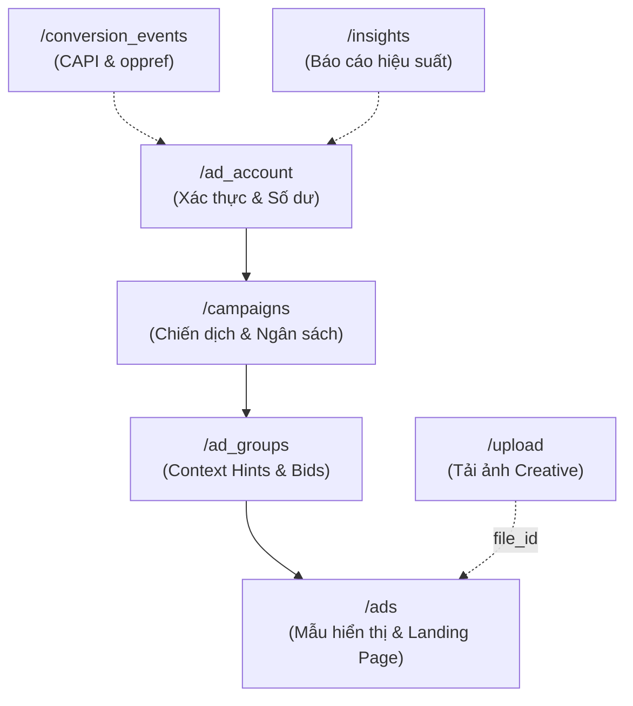

# Đặc Tả Kỹ Thuật: OpenAI Advertiser API (`api.ads.openai.com/v1`)

Tài liệu này đặc tả toàn bộ kiến trúc, phương thức xác thực và danh mục Endpoints chính thức của cổng lập trình **OpenAI Advertiser API** phục vụ tự động hóa và tích hợp Model Context Protocol (MCP).

---

## 1. Tổng Quan Kiến Trúc & Cổng Lập Trình

* **Base URL:** `https://api.ads.openai.com/v1`
* **Cổng tài liệu chính thức:** `https://developers.openai.com/ads`
* **Giao thức:** RESTful over HTTPS, định dạng trao đổi JSON chuẩn, mã hóa UTF-8.

### 1.1. Phân Biệt Sống Còn: Ads API Key vs Platform API Key
| Đặc tính | OpenAI Platform API Key | OpenAI Advertiser API Key |
| :--- | :--- | :--- |
| **Cổng quản lý** | `platform.openai.com` | `ads.openai.com` (Settings > API Keys) |
| **Mục đích** | Gọi mô hình LLM (GPT-4o, o1, o3, Embeddings) | Quản trị chiến dịch, nhóm quảng cáo, báo cáo, ngân sách |
| **Tính phí** | Tính phí theo Token In/Out tiêu thụ | Tính phí theo ngân sách quảng cáo thực tế (CPC/CPM/oCPC) |
| **Phạm vi (Scope)** | Cấp Organization / Project | **Scoped chặt chẽ theo từng Ad Account ID** (`act_...`) |
| **Định dạng Token** | Chuỗi `sk-...` | Khóa xác thực riêng biệt của hệ thống Ads |

> [!WARNING]
> Sử dụng API Key của `platform.openai.com` để gọi `api.ads.openai.com` sẽ bị trả về lỗi `401 Unauthorized` ngay lập tức. Mỗi tài khoản quảng cáo (Ad Account) sở hữu cặp API Key riêng.

---

## 2. Xác Thực & Headers Chuẩn (Authentication)

Mọi yêu cầu gửi lên API đều yêu cầu Header xác thực Bearer Token:
```http
Authorization: Bearer <YOUR_OPENAI_ADVERTISER_API_KEY>
Content-Type: application/json
Accept: application/json
```

---

## 3. Danh Mục Endpoints Chi Tiết



### 3.1. Xác Thực & Quản Lý Tài Khoản (Ad Account)
* **`GET /v1/ad_account`**
  * *Mục đích:* Kiểm tra tính hợp lệ của API Key, lấy thông tin tiền tệ, trạng thái thanh toán, hạn mức chi tiêu hàng ngày.
  * *Response mẫu:*
    ```json
    {
      "id": "act_01j8xyz987654321",
      "name": "Global Retail Store",
      "currency": "USD",
      "timezone": "America/New_York",
      "status": "active",
      "billing_status": "good_standing",
      "daily_spend_limit": 5000.00
    }
    ```

### 3.2. Quản Trị Chiến Dịch (Campaigns)
* **`GET /v1/campaigns`**: Lấy danh sách các chiến dịch (hỗ trợ phân trang, lọc theo `status`).
* **`POST /v1/campaigns`**: Tạo chiến dịch mới.
  * *Payload mẫu:*
    ```json
    {
      "name": "US_Sneakers_Summer_2026",
      "objective": "Clicks",
      "budget_type": "daily",
      "budget_amount": 250.00,
      "start_date": "2026-10-01",
      "countries": ["US"],
      "status": "active"
    }
    ```
* **`GET /v1/campaigns/{id}`**: Lấy chi tiết 1 chiến dịch.
* **`PATCH /v1/campaigns/{id}`**: Điều chỉnh ngân sách, trạng thái bật/tắt (`active`, `paused`).
* **`DELETE /v1/campaigns/{id}`**: Xóa chiến dịch.

### 3.3. Quản Trị Nhóm Quảng Cáo & Nạp Context Hints (Ad Groups)
* **`POST /v1/ad_groups`**: Tạo nhóm quảng cáo và nạp Semantic Context Hints.
  * *Payload mẫu:*
    ```json
    {
      "campaign_id": "cmp_01j7abc123456",
      "name": "Cushioned_Running_Shoes",
      "bid_amount": 3.50,
      "bid_strategy": "maximize_results",
      "context_hints": [
        "Giày chạy bộ êm ái hàng ngày cho người mới bắt đầu luyện tập cự ly 5K",
        "Giày thể thao đệm bọt khí hỗ trợ bảo vệ khớp gối cho người vận động nhiều"
      ]
    }
    ```
* **`PATCH /v1/ad_groups/{id}`**: Cập nhật giá thầu hoặc danh sách Context Hints (lưu ý: ghi đè toàn bộ mảng `context_hints`).

### 3.4. Quản Trị Mẫu Quảng Cáo & Tải Lên Media (Ads & Uploads)
* **`POST /v1/upload` (Multipart/form-data)**:
  * *Mục đích:* Tải ảnh sáng tạo (JPG/PNG, tối đa 1200x1200px, 1:1) lên CDN của OpenAI.
  * *Response:* Trả về `file_id` (ví dụ `file_01j8img999...`).
* **`POST /v1/ads`**: Tạo mẫu quảng cáo kết nối hình ảnh và trang đích.
  * *Payload mẫu:*
    ```json
    {
      "ad_group_id": "ag_01j7def789012",
      "name": "Creative_Cushion_v1",
      "title": "Giày Chạy Bộ Êm Ái 5K",
      "copy": "Đệm khí trợ lực phục hồi, bảo vệ tối đa khớp gối khi vận động.",
      "landing_page_url": "https://brand.com/shoes/cushion-5k",
      "file_id": "file_01j8img999888777",
      "status": "active"
    }
    ```

### 3.5. Báo Cáo & Số Liệu Hiệu Suất Thời Gian Thực (Insights & Reporting)
* **`GET /v1/ad_account/insights`** hoặc **`GET /v1/ads/{id}/insights`**
  * *Query Params:*
    * `start_date`: `2026-09-01`
    * `end_date`: `2026-09-24`
    * `granularity`: `hourly` hoặc `daily`
    * `metrics`: `impressions,clicks,spend,ctr,cpc,conversions`
  * *Đặc tính độ trễ:*
    * Clicks, Impressions, CTR: Cập nhật sau mỗi **15 phút**.
    * Chi phí tích lũy (Spend): Cập nhật sau **7–8 giờ**.

### 3.6. Giao Thức Chuyển Đổi Ngoại Tuyến (Conversions API)
* **`POST /v1/conversion_events`**: Đẩy sự kiện chuyển đổi từ server về hệ thống quy kết của OpenAI.
  * *Payload mẫu:*
    ```json
    {
      "data_source_id": "ds_01j7pixel123",
      "events": [
        {
          "event_name": "Purchase",
          "event_time": 1727170800,
          "event_id": "order_uuid_102938",
          "oppref": "gAAAAAb123456789xyz...",
          "user_data": {
            "em": ["2492fd6ae8b0de4e3f533a5b9da81fb9469957344e54f3093f121d5de69e40f1"]
          },
          "custom_data": {
            "currency": "USD",
            "value": 159.00
          }
        }
      ]
    }
    ```

### 3.7. Đồng Bộ Danh Mục Sản Phẩm (Product Feeds)
* **`GET /v1/feeds`**: Lấy danh sách các feed đã kết nối (Hosted HTTPS URL hoặc SFTP).
* **`POST /v1/feeds/{id}/sync`**: Kích hoạt quét và làm mới catalog tức thì.

### 3.8. Delta Feeds API: Cập Nhật Vi Mô Không Cần Nạp Lại Toàn Bộ Catalog
* **`PATCH /v1/feeds/{feed_id}/products`**
  * *Mục đích:* Chỉ gửi các biến thể (variants) thay đổi giá hoặc trạng thái kho, tránh tải lại toàn bộ catalog.
  * *Lưu ý tiền tệ:* `price.amount` tính bằng đơn vị phụ (**minor units**, ví dụ: `8999` là `$89.99`).
  * *Payload mẫu:*
    ```json
    {
      "products": [
        {
          "id": "running-shoe-001",
          "variants": [
            {
              "id": "running-shoe-001-black-9",
              "availability": { "status": "out_of_stock", "available": false }
            },
            {
              "id": "running-shoe-001-white-9",
              "title": "Running shoe - white, size 9",
              "price": { "amount": 8999, "currency": "USD" },
              "availability": { "status": "in_stock", "available": true }
            }
          ]
        }
      ]
    }
    ```

### 3.9. Bulk Mutation Jobs API: Xử Lý Bất Đồng Bộ DAG (Tối Đa 1.000 Tác Vụ)
* **`POST /v1/bulk_mutation_jobs`**
  * *Mục đích:* Khởi tạo đồng thời Campaign, Ad Group, Ads theo mô hình đồ thị phụ thuộc (DAG) trong 1 job duy nhất.
  * *Hỗ trợ độc quyền:* **`exclusion_hints`** (gợi ý loại trừ ngữ cảnh) ở Ad Group, ngân sách tính bằng **micros** (`max_budget_micros: 100000000` = $100.00).
  * *Payload mẫu:*
    ```json
    {
      "validate_only": false,
      "partial_failure": true,
      "operations": [
        {
          "operation_id": "op-campaign-1",
          "type": "campaign.create",
          "idempotency_key": "camp-spring-2026",
          "input": {
            "name": "Spring Launch",
            "max_budget_micros": 100000000,
            "billing_event_type": "impression",
            "budget_type": "lifetime",
            "status": "paused"
          }
        },
        {
          "operation_id": "op-adgroup-1",
          "type": "ad_group.create",
          "idempotency_key": "ag-prospecting-1",
          "input": {
            "campaign_idempotency_key": "camp-spring-2026",
            "name": "Running Prospects",
            "context_hints": ["giày chạy bộ cự ly 5K", "giày tập hàng ngày"],
            "exclusion_hints": ["giày cao gót", "giày da công sở"],
            "max_bid_micros": 3500000,
            "status": "paused"
          }
        },
        {
          "operation_id": "op-ad-1",
          "type": "ad.create",
          "idempotency_key": "ad-creative-1",
          "input": {
            "campaign_idempotency_key": "camp-spring-2026",
            "ad_group_idempotency_key": "ag-prospecting-1",
            "title": "Giày Chạy Bộ 5K Mới",
            "body": "Đệm bọt khí êm ái bảo vệ khớp gối.",
            "target_url": "https://example.com/shoes",
            "source_image_url": "https://cdn.example.com/shoes-sq.jpg",
            "status": "paused"
          }
        }
      ]
    }
    ```

### 3.10. Phân Tầng Nền Tảng (Platform Targeting)
* Thiết lập tại trường `targeting.platforms.included` trong Campaign:
  * `android_app`: Ứng dụng ChatGPT native trên Android
  * `android_web`: Trình duyệt web trên Android
  * `ios_app`: Ứng dụng ChatGPT native trên iOS
  * `ios_web`: Trình duyệt web trên iOS
  * `desktop_web`: Trình duyệt máy tính bàn
  * `web`: Tất cả nền tảng web


## 4. Cơ Chế Hoạt Động Của Các MCP Server (PaidSync, HYPD)

Các MCP Server cho ChatGPT Ads hoạt động như một lớp Proxy thông minh trung gian giữa AI Agent (Claude, Cursor, Antigravity) và OpenAI Advertiser API:

```
+------------------+         MCP JSON-RPC         +-------------------------+
| Antigravity / AI | <--------------------------> | openai-ads-mcp          |
| Agent Interface  |   (tools: create_campaign,   | (@hypd / PaidSync)      |
|                  |    get_insights, etc.)       +-------------------------+
+------------------+                                           |
                                                      REST / HTTPS
                                                  (Bearer AD_API_KEY)
                                                               |
                                                               v
                                                  +-------------------------+
                                                  | api.ads.openai.com/v1   |
                                                  +-------------------------+
```

### 4.1. Nguyên Tắc Approval-Gated (Bảo Vệ Ngân Sách)
Các tool ghi đè (Write Operations) như `create_campaign`, `update_budget`, `adjust_bids` luôn được thiết kế kèm cơ chế **Human-in-the-loop** (hoặc Native Modal `ask_question`), đảm bảo AI không tự ý nâng ngân sách hay thay đổi giá thầu mà không có sự phê duyệt tường minh của người quản trị.
