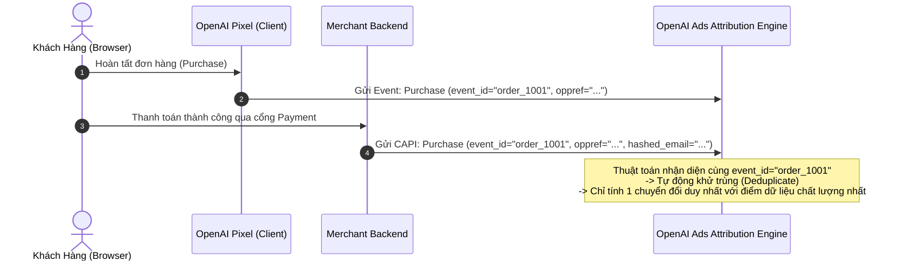

# Đo Lường Chuyển Đổi: `oppref`, OpenAI Pixel & Conversions API (CAPI)

Tài liệu này đặc tả cơ chế định danh lượt click, theo dõi chuyển đổi đa điểm chạm và giao thức Server-to-Server cho ChatGPT Ads.

---

## 1. Tham Số Định Danh Click Độc Quyền: `oppref`

Tương tự như `gclid` (Google Click ID) hay `fbclid` (Meta Click ID), hệ thống ChatGPT Ads tự động nối một tham số truy vấn duy nhất vào cuối URL trang đích khi người dùng nhấp vào quảng cáo:

```
https://yourstore.com/product-abc?oppref=gAAAAAb123...
```

### 1.1. Cơ Chế Hoạt Động & Yêu Cầu Kỹ Thuật
1. **Lưu trữ Cookie bên thứ nhất (First-Party Cookie):** Đoạn mã OpenAI Pixel tự động trích xuất giá trị `oppref` từ URL và lưu vào cookie trình duyệt của người dùng.
2. **Bảo toàn qua chuyển hướng (Redirects):** Nếu website thực hiện chuyển hướng (ví dụ: HTTP -> HTTPS, rút gọn link, hoặc chuyển tiếp giữa các tên miền), **BẮT BUỘC** phải chuyển tiếp toàn bộ chuỗi query param, không được làm rụng `oppref`. Nếu `oppref` bị mất trong quá trình redirect, sự kiện chuyển đổi sau đó sẽ không thể quy kết cho lượt click quảng cáo.
3. **Truyền vào Conversions API:** Khi người dùng hoàn tất giao dịch ngoại tuyến hoặc backend xử lý đơn hàng, backend cần trích xuất `oppref` từ session/cookie và gửi kèm trong payload gửi lên OpenAI CAPI.

---

## 2. OpenAI Pixel & Tự Động Khớp Nâng Cao (Automatic Advanced Matching)

### 2.1. Cài Đặt OpenAI Pixel
Chèn đoạn mã Pixel vào thẻ `<head>` trên toàn bộ các trang của website:

```html
<!-- OpenAI Pixel Code -->
<script>
!function(w,d,e,u,t,s){if(w.opix)return;t=w.opix=function(){t.callMethod?
t.callMethod.apply(t,arguments):t.queue.push(arguments)};t.push=t;t.loaded=!0;t.version='1.0';
t.queue=[];s=d.createElement(e);s.async=!0;s.src=u;
var f=d.getElementsByTagName(e)[0];f.parentNode.insertBefore(s,f)}
(window,document,'script','https://analytics.openai.com/pixel.js');

opix('init', 'PIXEL_DATA_SOURCE_ID');
opix('track', 'PageView');
</script>
<!-- End OpenAI Pixel Code -->
```

### 2.2. Tự Động Khớp Nâng Cao (Automatic Advanced Matching - AAM)
* **Nguyên lý bảo mật:** OpenAI Pixel tự động quét các trường form nhận diện khách hàng (Email, Số điện thoại) khi họ đăng ký hoặc thanh toán.
* **Mã hóa tại Client:** Pixel tự động chuẩn hóa (trim, lowercase) và băm một chiều bằng thuật toán **SHA-256** trực tiếp ngay trên trình duyệt trước khi gửi về máy chủ OpenAI.
* Dữ liệu thô (plain text) **tuyệt đối không bao giờ** được gửi về OpenAI.

---

## 3. Kiến Trúc Khử Trùng Lặp (Deduplication): Pixel + Conversions API

Để đạt độ bền vững tối đa (chống Ad-blocker và Safari ITP), nên triển khai song song cả **Browser Pixel** và **Server CAPI**.



### 3.1. Các Sự Kiện Tiêu Chuẩn (Standard Conversion Events)
* `Purchase`: Hoàn tất mua hàng (kèm `value`, `currency`).
* `Lead`: Điền form đăng ký tư vấn.
* `CompleteRegistration`: Tạo tài khoản thành công.
* `AddPaymentInfo`: Thêm thông tin thẻ/thanh toán.
* `ViewContent`: Xem trang sản phẩm chi tiết.

### 3.2. Mẫu Payload Conversions API (JSON)
```json
{
  "data_source_id": "ds_01j7xxxxxxxxx",
  "events": [
    {
      "event_name": "Purchase",
      "event_time": 1727170800,
      "event_id": "order_uuid_98765",
      "oppref": "gAAAAAb123456789xyz...",
      "user_data": {
        "em": ["2492fd6ae8b0de4e3f533a5b9da81fb9469957344e54f3093f121d5de69e40f1"],
        "ph": ["d057778ff9f2c695882cd8ad1779f67a28eb..."]
      },
      "custom_data": {
        "currency": "USD",
        "value": 129.00
      }
    }
  ]
}
```

---

## 4. Theo Dõi Không Cần JavaScript: Thẻ Image Tag (1x1 Pixel)

Dành cho môi trường không hỗ trợ JavaScript (email HTML, trình duyệt tắt JS) hoặc đặt làm phương án dự phòng bên trong thẻ `<noscript>`.

### 4.1. Cấu Trúc Thẻ HTML 1x1 Pixel
```html
<noscript>
  &event=order_created&event_id=evt_123456&oppref=<OPPREF>&data[type]=contents&data[amount]=2599&data[currency]=USD"
    width="1"
    height="1"
    style="display:none"
    alt=""
  />
</noscript>
```

### 4.2. Bảng Tham Số Image Tag
* `pid` (Bắt buộc): Pixel ID lấy từ Ads Manager.
* `event` (Bắt buộc): Tên sự kiện chuẩn (`page_viewed`, `order_created`, v.v.) hoặc `custom`.
* `event_id` (Khuyến nghị): Khóa khử trùng lặp khớp với Conversions API.
* `oppref` (Tùy chọn): Tham số Click ID nếu hệ thống backend đã lưu sẵn trong session.
* `data[type]`: Kiểu dữ liệu sự kiện (thường là `contents` hoặc `custom`).
* `data[amount]`: Giá trị giao dịch dạng integer (ví dụ `2599` là `$25.99`).
* `data[currency]`: Đơn vị tiền tệ chuẩn ISO 4217 (ví dụ `USD`).

